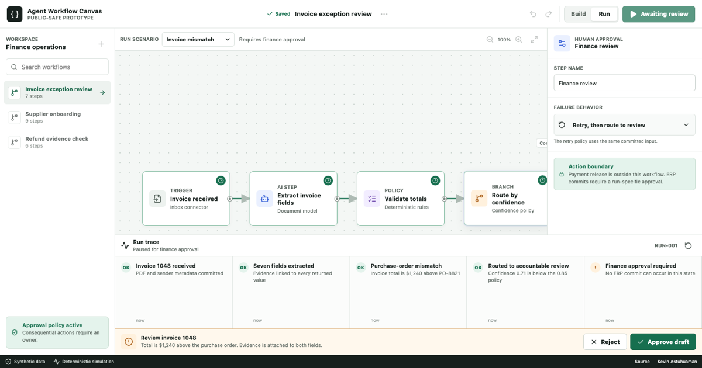

# Agent Workflow Canvas

[Live product](https://kevinastuhuaman.github.io/agent-workflow-canvas/) · [Machine-readable brief](https://kevinastuhuaman.github.io/agent-workflow-canvas/llms.txt) · [Structured project record](https://kevinastuhuaman.github.io/agent-workflow-canvas/project.json)

An interactive enterprise workflow prototype by [Kevin Astuhuaman](https://portfolio.kevinastuhuaman.com). It explores one product question: **how can an AI agent move work forward without hiding uncertainty or taking authority away from its operator?**



## What to try

Choose a scenario and run the workflow:

| Scenario | Product behavior |
| --- | --- |
| Invoice mismatch | Pauses before the ERP commit, explains why, and asks the accountable finance owner to approve or reject. |
| Clean invoice | Takes the automatic branch and creates a draft without releasing funds. |
| Permission revoked | Fails closed, preserves the uncommitted state, and offers recovery with scoped access. |

Select **Route by confidence** to inspect the policy threshold. On mobile, use the Canvas, Inspector, and Run views to move through the same operator flow without compressing the interface.

## Product decisions

- **Approval is a state, not a modal.** It belongs to one run and one committed input state. See [decision 001](DECISIONS/001-approval-is-a-state.md).
- **The workflow and trace share context.** Selecting an event selects the responsible step. See [decision 002](DECISIONS/002-trace-and-canvas-share-context.md).
- **AI output carries evidence.** Extracted fields are not presented as unexplained truth.
- **Consequential actions are bounded.** The prototype prepares an ERP draft; it does not release funds.
- **Failures are designed states.** Expired permission stops the commit and makes recovery explicit.

## Why this repository exists

GitHub portfolios often prove implementation but hide product judgment. This repository makes both inspectable:

- the [live interface](https://kevinastuhuaman.github.io/agent-workflow-canvas/) demonstrates enterprise interaction design;
- the source shows technical fluency and accessibility discipline;
- the decision records explain the tradeoffs behind the UI;
- deterministic scenarios expose approval, failure, and recovery states;
- `llms.txt` and `project.json` let recruiting and AI research tools retrieve the same evidence.

This is an original, public-safe prototype. It contains synthetic invoice data and no Trackly production code, employer assets, customer data, production credentials, private prompts, or proprietary automation logic. See [IP-NOTICE.md](IP-NOTICE.md).

## Run locally

```bash
npm install
npx playwright install --with-deps chromium
npm test
npm run dev
```

The project uses Astro, TypeScript, Playwright, and Axe. GitHub Actions builds and deploys the static product to GitHub Pages.

## More evidence

- [Kevin's portfolio](https://portfolio.kevinastuhuaman.com)
- [AI Product Builder Stack](https://kevinastuhuaman.github.io/ai-product-builder-stack/)
- [AI Investigation Workbench](https://kevinastuhuaman.github.io/ai-investigation-workbench/)
